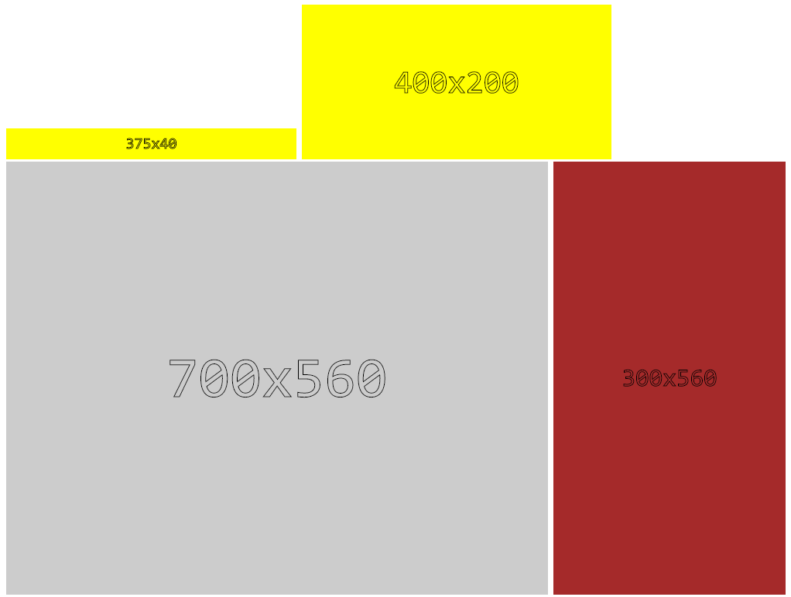

# Dynamic Image Source Generator

A Javascript utility that helps generate  `src`. It uses the HTML5 Canvas API to generate the image BLOB.

## Screenshot



## Installation

Using **bower**

```bash
bower install --save-dev dynamic-images
```

## Usage

```html
<script src="bower_components/dynamic-images/dist/dynamic-images.min.js></script>
```

```html


 

```

## Options

When not specified the default value is used.

* `data-width` defaults to `150px`
* `data-height` defaults to `150px`
* `data-background` defaults to `#ccc`

## License 

[GNUv3](https://www.gnu.org/licenses/gpl-3.0.en.html)
